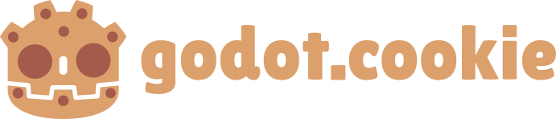

<p align="center">
  
</p>

`godot.cookie` is an opinionated cookiecutter template for spinning up new Godot projects. It aims to be a flexible starting point for game jams and small-scale commercial projects alike.

## Features
Currently, `godot.cookie` generates:
- A simple main menu
- A 'settings' system, wherein user settings are persisted to local storage via a `.cfg` file
- Scaffolding for a flexible & robust scene tree structure (see below)

## Scene Tree Structure
`godot.cookie` generates scaffolding to support the following general scene tree structure for your games:
```
- Main
  - World (Node2D/Node3D)
  - UI (Control)
```
This serves as the definitive entrypoint of your game. To control the game flow, the `Main` node is responsible for swapping out the children of the `World` and `UI` nodes.

## Usage
Once you've installed [cookiecutter](https://github.com/cookiecutter/cookiecutter), you can set up a new project by simply running:
```sh
cookiecutter gh:DillonSteyl/godot.cookie
```
